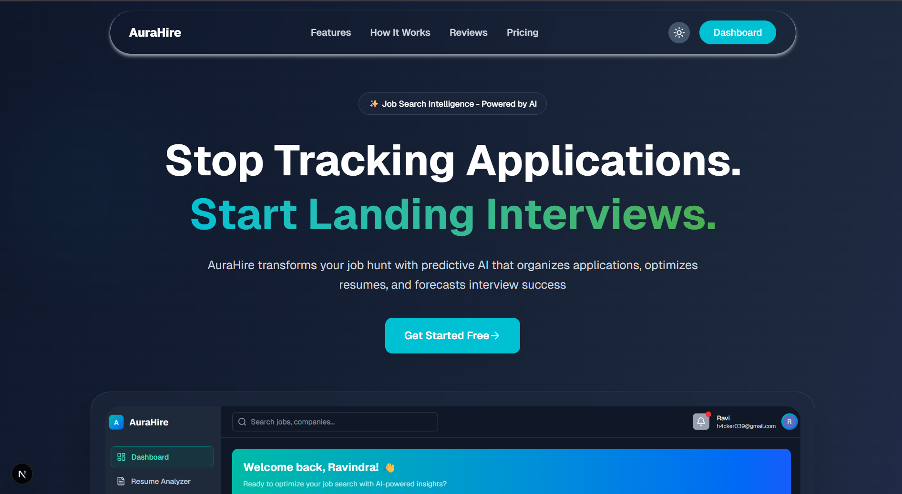

<div align="center">

# 🚀 AuraHire

**Job Search Intelligence - Powered by Google AI**  
Stop tracking applications. Start landing interviews.

[](https://gssoc.girlscript.tech/)
[](LICENSE)
[](https://turbo.build/)


[](https://github.com/Ryadav0654/aurahire)
[](https://github.com/Ryadav0654/aurahire/forks)
[](https://github.com/Ryadav0654/aurahire/graphs/contributors)
[](https://github.com/Ryadav0654/aurahire/issues)
<br />

[](https://nextjs.org/)
[](https://react.dev/)
[](https://tailwindcss.com/)
[](https://www.typescriptlang.org/)
[](https://cloudinary.com/)
[](https://clerk.com/)
[](https://ai.google/)
[](https://ui.shadcn.com/)
[](https://redux-toolkit.js.org/) 
[](https://www.docker.com/)
[](https://expressjs.com/)
[](https://mongodb.com/)
[](https://github.com/features/actions)

</div>

## 📖 Table of Contents
- [Overview](#✨-overview)
- [Current Implementation Status](#🚀-current-implementation-status)
- [Quick Start](#🛠-quick-start)
  - [Prerequisites](#prerequisites)
- [Contributing](#🤝-contributing)
- [License](#📄-license)

## ✨ Overview
AuraHire transforms your job search with Google AI-powered tools that organize applications, optimize resumes, and predict interview success. Perfect for contributors looking to work on modern AI-integrated web development.

<div align="center">


</div>


## 🚀 Current Implementation Status
| Component       | Status | Details |
|-----------------|--------|---------|
| Web Frontend    | ✅     | Next.js with Clerk auth |
| API Backend     | 🔜     | Express.js endpoints |
| Docker Setup    | 🔜     | Containerization |
| Google AI       | 🔜     | Resume optimization |
| MongoDB         | 🔜     | Application storage |

## 🏗 Project Structure
```bash
aurahire/
├── apps/
│   ├── web/           # Next.js frontend
│   │   ├── app/       # Application routes
│   │   ├── components # UI components
│   │   └── ...        
│   └── api/           # Express.js backend
│       ├── src/       # Server source
│       └── ...        
├── packages/
│   ├── config/        # Shared configs
│   ├── ui/            # UI components library
│   └── ...            # Other shared packages
├── docker-compose.yml # Docker setup
├── Dockerfile         # Production Dockerfile
└── turbo.json         # Turborepo config
```

## 🛠 Quick Start

### Prerequisites
- Node.js 18.x+
- Docker 20.x+
- MongoDB (or Docker for MongoDB)


## 🧩 Tech Stack
<div align="center">

| Component       | Technologies                                                                 |
|-----------------|------------------------------------------------------------------------------|
| **Frontend**    | Next.js, React, Tailwind CSS, Shadcn UI                                      |
| **Backend**     | Express.js, MongoDB, Mongoose                                               |
| **Build System**| Turborepo, Vite                                                             |
| **Infrastructure**| Docker, Docker Compose                                                     |
| **Auth**        | Clerk                                                                        |
| **AI**          | Google Generative AI API                                                     |

</div>

## 🤝 Contributing
We welcome contributions! Please read our [Contributing Guide](CONTRIBUTING.md) for details on our code of conduct, and the process for submitting pull requests.

## 👥 Our Contributors
<a href="https://github.com/Ryadav0654/aurahire/graphs/contributors">
  
</a>

## 📄 License
Distributed under the MIT License. See [LICENSE](LICENSE) for more information.

<div align="center">
  <br />
  <strong>Ready to transform job searching?</strong>
  <br />
  <a href="https://github.com/Ryadav0654/aurahire">Explore the Docs</a> • 
  <a href="https://github.com/Ryadav0654/aurahire/issues">Report Bug</a> • 
  <a href="https://github.com/Ryadav0654/aurahire/pulls">Request Feature</a>
</div>

